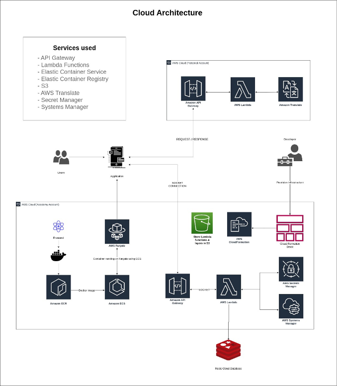
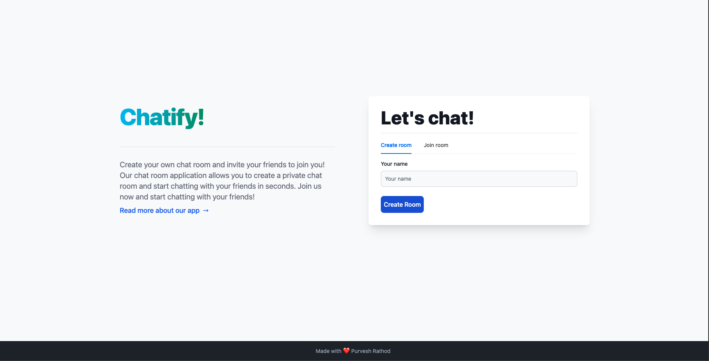
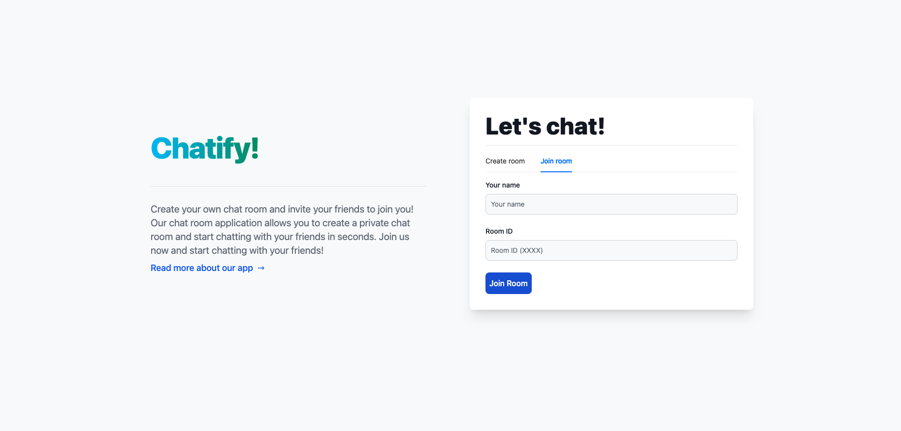

# Chatify - A serverless chat application

[Application Link](https://app-chatify.netlify.app/)

This application was a part of my graduate studies CSCI 5409 - Advanced Cloud Computing course project. 

## Application Architecture

## Create a room to chat with your friends.

Note: No messages are saved on the server which makes it secure.

## Join an already created room - Requires a Room ID.

